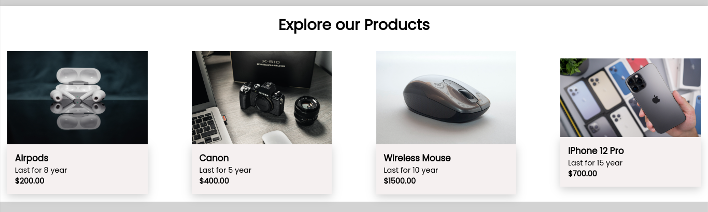
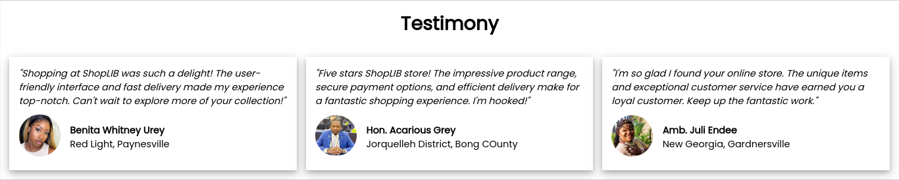

<h1>Project Title: ShopLIB</h1>
<h2>Description:</h2>

ShopLIB is an online store that helps Liberians to buy goods on our platform instead of going to the market.

<h2>Features:</h2>

<b>Explore Our Products:</b> In this section you will be able to veiw products names, price and gaurantee

<b>Testimony:</b> In this section you will be able to view testimonies from all customers.

<h2>Our Team:</h2>

1. Prince Q. Dolo
2. Sieh O. Dorbor
3. Benjamin A. Ngafua - <i>Mentor</i>

<h2>Technologies Used:</h2>

+ HTML - (dominently div)
+ CSS - (Flexbox)
+ JavaScript - (Arrays, Objects, Loops & Builtin functions)

<h2>Inspired by:</h2>

> Kwagei